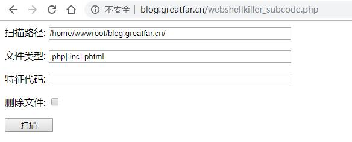
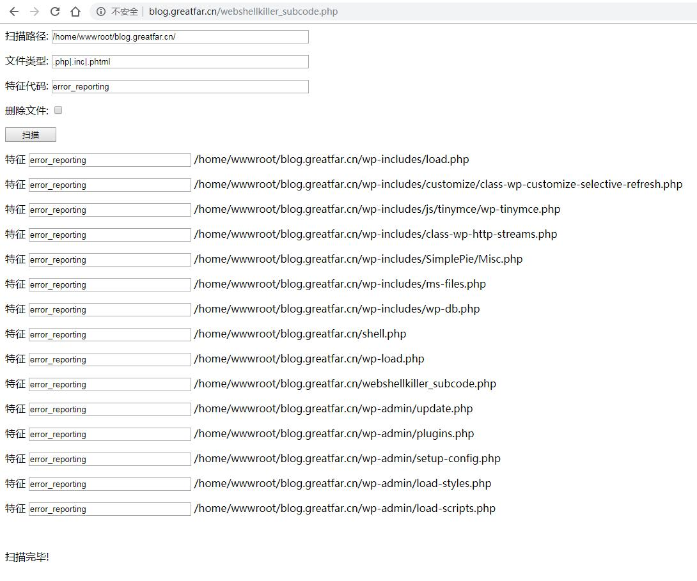
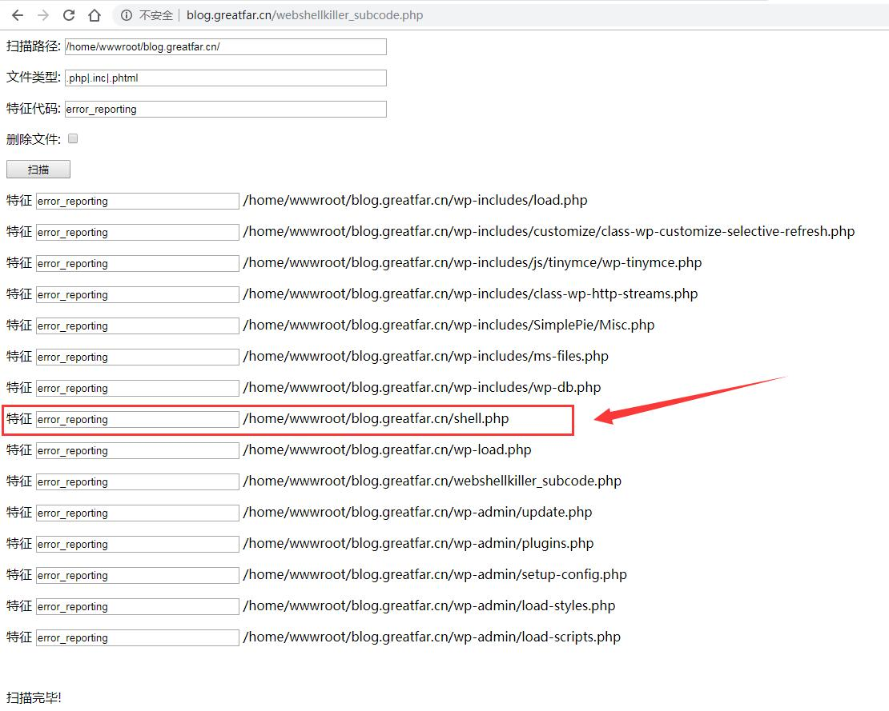
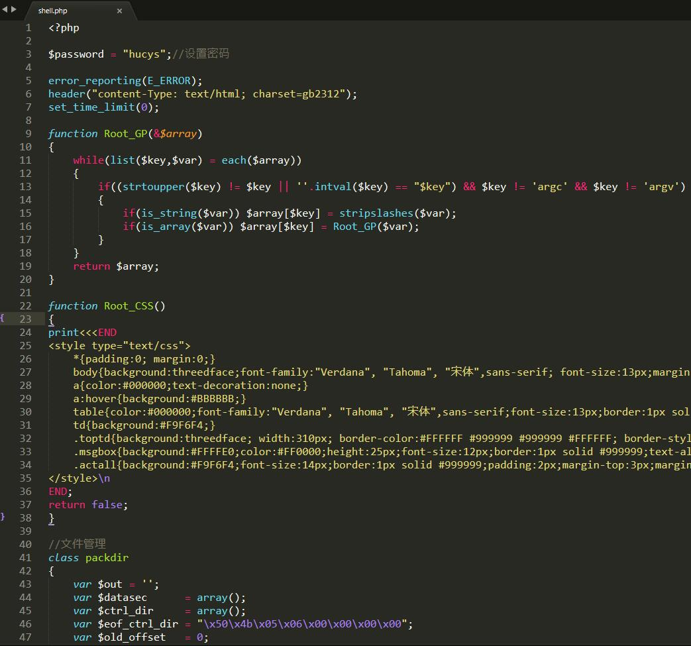
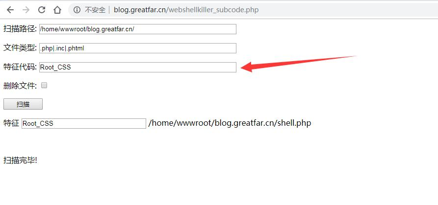

# php-webshellkiller
php webshell 网站后门扫描器

## 说明 ##

1. webshellkiller.php  
[http://www.php.cn/php-weizijiaocheng-385975.html](http://www.php.cn/php-weizijiaocheng-385975.html)提供的webshell扫描代码

2. webshellkiller_subcode.php  
参考webshellkiller.php衍生出来的通过webshell特征代码查杀，用于查杀已知样本的webshell   

## webshellkiller_subcode.php ##

1. 增加特征代码输入框
2. 增加删除扫描到的webshell功能
3. 增加日志功能
4. 增加删除webshell前备份功能  

# **使用示例** #

----------

> 
**步骤1**：上传`webshellkiller_subcode.php` 到网站根目录，并访问该文件`http://xxxx/webshellkiller_subcode.php` ，访问效果如下：

----------

----------
> 
**步骤2**：填写特征代码，特征码是指某个webshell特定的代码，比如大部分webshell都会禁止错误输出，例如会存在`error_reporting(0);`的代码，但是存在`error_reporting(0);`的PHP文件并不一定是webshell。那么，可以在特征码中填入`error_reporting`，扫描，扫描结果如下：

----------

----------
> 
**步骤3**：可以发现一个如下图所示的可疑的php文件`shell.php` 

----------

----------
> 
**步骤4**：可查看步骤3中的`shell.php`，发现确实是个webshell，其源码如下图所示：

----------

----------
> 
**步骤5**：通过查看shell.php的源码，建议把该shell的某个函数名设置为特征码，再次查找，就可以精确查找出网站中的所有该类型的webshell变种，把查找到的shell删除即可。

----------

----------
